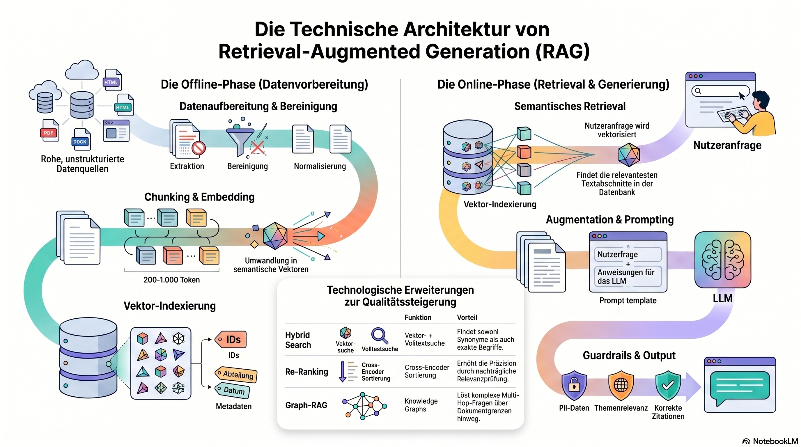

**Retrieval-Augmented**

**Generation (RAG)**

Der holistische Fachartikel

Architektur, Use Cases und Implementierung im Unternehmen

Fachartikel | Business Intelligence

April 2026

SEO-optimiert | Clean Copy | Karl Krat Methodik

**Inhaltsverzeichnis**

[1 | Was ist RAG? Definition, Einordnung, Nutzen 2](#_Toc100000)

[1.1 Klare Definition 3](#_Toc100001)

[1.2 Abgrenzung: RAG vs. LLM-Standardnutzung, Fine-Tuning, klassische Chatbots 3](#_Toc100002)

[1.3 Warum RAG ein Paradigmenwechsel ist 3](#_Toc100003)

[1.4 Typische Probleme, die RAG löst 4](#_Toc100004)

[2 | Wie funktioniert RAG technisch? 4](#_Toc100005)

[2.1 Datenquellen und Dokumentvorbereitung 4](#_Toc100006)

[2.2 Chunking und Embeddings 5](#_Toc100007)

[2.3 Vektordatenbanken und Retrieval 5](#_Toc100008)

[2.4 Augmentation und Prompt-Engineering 5](#_Toc100009)

[2.5 Antwortgenerierung und Guardrails 6](#_Toc100010)

[2.6 Erweiterungen: Re-Ranking, Hybrid Search, Agents, Graph-RAG 7](#_Toc100011)

[3 | Vorteile von RAG für Unternehmen 7](#_Toc100012)

[Faktenbasierte Antworten statt Modell-Mutationen 8](#_Toc100013)

[Erschließung von internem Wissen - ohne Migration 8](#_Toc100014)

[Signifikante Reduktion von Halluzinationen 8](#_Toc100015)

[Skalierbarkeit ohne Fine-Tuning 9](#_Toc100016)

[Compliance, Audit und DSGVO auf Architekturebene 9](#_Toc100017)

[4 | RAG vs. Alternativen: Wann welche Strategie dominiert 9](#_Toc100018)

[4.1 RAG vs. Fine-Tuning 9](#_Toc100019)

[4.2 RAG vs. klassische Suche 10](#_Toc100020)

[4.3 RAG vs. FAQ-Bots 10](#_Toc100021)

[4.4 Der Hybridansatz: RAG + Fine-Tuning 10](#_Toc100022)

[5 | Softwarelösungen und Systeme: Die RAG-Tool-Landschaft 11](#_Toc100023)

[5.1 LangChain und LangGraph 11](#_Toc100024)

[5.2 LlamaIndex 11](#_Toc100025)

[5.3 Azure AI Search + Azure OpenAI 12](#_Toc100026)

[5.4 Elasticsearch mit ELSER und Vector Search 12](#_Toc100027)

[5.5 Pinecone, Weaviate, Qdrant 12](#_Toc100028)

[5.6 OpenAI Assistants API und Retrieval API 13](#_Toc100029)

[5.7 Enterprise-Suiten: SAP, Databricks, Snowflake 13](#_Toc100030)

[6 | Die 4 wichtigsten Use Cases für RAG in der Business Intelligence 13](#_Toc100031)

[6.1 Wissenssuche und Knowledge Management 14](#_Toc100032)

[6.2 Dokumentanalyse und Compliance 14](#_Toc100033)

[6.3 Support-Automatisierung und Produktdokumentation 14](#_Toc100034)

[6.4 Entscheidungsunterstützung und Report-Interpretation 15](#_Toc100035)

[7 | RAG-Architektur: Datenfluss, Komponenten und Erweiterungen 15](#_Toc100036)

[7.1 Datenfluss: Offline und Online 15](#_Toc100037)

[7.2 Kernkomponenten der Architektur 16](#_Toc100038)

[7.3 Architekturelle Erweiterungen 17](#_Toc100039)

[8 | Best Practices und typische Fehler: Was Productions-RAG-Pipelines ausmacht 18](#_Toc100040)

[8.1 Chunking-Strategien: Die Grundlage alles 18](#_Toc100041)

[8.2 Retrieval-Tuning: Top-k, Hybrid Search, Re-Ranking 18](#_Toc100042)

[8.3 Prompt-Struktur: Das unsichtbare Nadelöhr 19](#_Toc100043)

[8.4 Evaluierung und Benchmarks: Ohne Messung keine Optimierung 19](#_Toc100044)

[8.5 Sicherheit, Governance und Betrieb 20](#_Toc100045)

[9 | Implementierungsleitfaden: Von der Idee zur Produktion 20](#_Toc100046)

[9.1 Voraussetzungen: Was vor dem Start geklärt sein muss 20](#_Toc100047)

[9.2 Quick-Start-Architektur: Der MVP in vier Schichten 21](#_Toc100048)

[9.3 Build vs. Buy: Die strategische Entscheidung 21](#_Toc100049)

[9.4 Aufwand und Kostenrahmen: Realistische Orientierung 22](#_Toc100050)

_Hinweis: Bitte rechtsklicken Sie auf das Inhaltsverzeichnis und wählen Sie „Felder aktualisieren", um die Seitenzahlen zu aktualisieren._

# **1 | Was ist RAG? Definition, Einordnung, Nutzen**

Retrieval-Augmented Generation (RAG) kombiniert informationsretrieval mit generativer KI: Ein Sprachmodell erhält bei jeder Anfrage zusätzlich zum Prompt relevante Textabschnitte aus definierten Wissensquellen und generiert seine Antwort auf Basis dieser kontextbezogenen Daten - nicht aus seinem trainierten Weltwissen allein. Das Ergebnis: faktenbasierte, quellenbelegbare Antworten statt kreativ erfundener Modell-Ausgaben.

## **1.1 Klare Definition**

RAG ist eine Architektur, kein einzelnes Produkt. Der Ablauf folgt drei Stufen: Retrieval (Suche nach relevanten Dokumentabschnitten), Augmentation (Einfügen dieser Abschnitte in den Prompt) und Generation (das LLM formuliert die finale Antwort). Kurz gesagt: RAG = Suche + LLM. Die Suche liefert Fakten, das Sprachmodell sprachliche Präzision.

Technisch greift RAG auf Embedding-Modelle und Vektordatenbanken zurück, um eine semantische Suche über Unternehmensdokumente zu ermöglichen. Der Abruf basiert auf Bedeutung, nicht auf exakten Keyword-Matches - eine Anfrage wie „Wie melde ich Reisekosten?" findet auch Texte, in denen von „Spesenabrechnung" oder „Tagesauslagen" die Rede ist. Genau diese Fähigkeit unterscheidet RAG von klassischen Suchmaschinen und macht es für unternehmensinterne Wissensanwendungen nutzbar.

## **1.2 Abgrenzung: RAG vs. LLM-Standardnutzung, Fine-Tuning, klassische Chatbots**

**LLM-Standardnutzung** (z. B. ChatGPT): Das Modell antwortet ausschließlich aus seinem trainierten Weltwissen. Interne Dokumente, aktuelle Richtlinien oder firmenspezifische Prozesse kennt es nicht. Problematisch ist insbesondere die Neigung zu Halluzinationen - das Modell gibt plausible, aber falsche Antworten auf domänenspezifische Fachfragen.

**Fine-Tuning:** Hier wird das Modell mit zusätzlichem Datensatz nachtrainiert. Der Vorteil: Stil und domänenspezifische Muster verändern sich. Der Nachteil: Der Wissensstand friert zum Trainingszeitpunkt ein. Jede Aktualisierung erfordert erneutes Training - aufwendig, teuer und transparenzarm. Fine-Tuning eignet sich für Tonality und Formatierung, nicht für dynamische Faktenvermittlung.

**Klassische Chatbots und FAQ-Systeme:** Regelbasierte Systeme mit simpler Volltextsuche liefern vorgefertigte Antworten. Komplexe oder neuartige Fragen können sie nicht interpretieren. Der Antwortspielraum ist starr begrenzt. RAG hingegen generiert kontextangepasste, frei formulierte Antworten - bei jedem Anfragemodus neu.

## **1.3 Warum RAG ein Paradigmenwechsel ist**

**Datenzentrierung statt Modellzentrierung.** Der Wert liegt nicht mehr im perfekten Modell, sondern in der sauberen, gouvernanzierten Datenbasis. Das Modell wird zum Formatter, die Daten zum eigentlichen Wissenskern. Wer seine Dokumente und Prozesse im Griff hat, gewinnt - unabhängig davon, welches LLM im Hintergrund läuft.

**Verlässlichkeit durch Grounding.** Jede RAG-Antwort lässt sich mit Quellen belegen. In regulierten Branchen - Finanzwesen, Gesundheitswesen, öffentlicher Sektor - ist das kein Nice-to-have, sondern eine Compliance-Anforderung. Die Frage „Woher kommt diese Aussage?" lässt sich beantworten; das unterscheidet RAG fundamental von Black-Box-LLM-Ausgaben.

**Time-to-Value in Wochen, nicht Monaten.** Fine-Tuning-Projekte dauern oft Quartale. RAG-Systeme lassen sich mit vorgefertigten Frameworks (LangChain, LlamaIndex) und Managed Services (Azure AI Search, Pinecone) in vier bis acht Wochen produktiv setzen - ohne dass das Modell selbst trainiert werden muss.

## **1.4 Typische Probleme, die RAG löst**

| **Problem**                       | **Warum es auftritt**                                 | **RAG-Lösung**                                                   |
| --------------------------------- | ----------------------------------------------------- | ---------------------------------------------------------------- |
| Veraltete Informationen im Modell | Trainingsdaten sind beim Schnittzeitpunkt eingefroren | Kontext wird live aus aktuellen Dokumenten abgerufen             |
| Hohe Halluzinationsrate           | LLM rät bei Wissenslücken plausible Antworten         | Antworten basieren ausschließlich auf bereitgestellten Quellen   |
| Kein Zugang zu internem Wissen    | Modelle kennen keine Intranet-Dokumente               | Unternehmensrepositorien werden als Retrieval-Quellen angebunden |
| Fehlende Nachvollziehbarkeit      | Black-Box-Ausgabe ohne Herkunftsnachweis              | Jede Antwort enthält Quellenverweise auf die Ursprungsdokumente  |

# **2 | Wie funktioniert RAG technisch?**
        
RAG funktioniert in zwei Phasen: Eine Offline-Phase bereitet Dokumente auf und indexiert sie als Vektoren. Eine Online-Phase empfängt eine Nutzeranfrage, sucht semantisch passende Textabschnitte, fügt diese als Kontext in einen Prompt ein und lässt ein LLM die finale Antwort generieren. Die gesamte Pipeline ist modular aufgebaut - jeder Baustein lässt sich unabhängig austauschen und optimieren.
  <figure class="img">
          
          <figcaption>Caption text</figcaption>
        </figure>
		## **2.1 Datenquellen und Dokumentvorbereitung**

Bevor RAG suchen kann, muss es etwas geben, durch das gesucht wird. Typische Unternehmensquellen: Intranet, SharePoint, Confluence, CRM- und ERP-Systeme, Ticketsysteme, PDF-Archive, SQL-Datenbanken. Frameworks wie LangChain und LlamaIndex stellen vorgefertigte Connectors für diese Quellen bereit - das manuelle Parsen einzelner Formate entfällt weitgehend.

Die Vorbereitung folgt einem dreistufigen Prozess: Erst die Extraktion (Dokumente werden aus Quellsystemen geladen und Metadaten wie Autor, Datum, Abteilung erfasst), dann die Bereinigung (Kopf- und Fußzeilen, Navigationselemente, Formatierungsartefakte werden entfernt) und schließlich die Normalisierung (einheitliche Zeichenkodierung, Sprache, Bereinigung von Rauschen wie Tabellen-Trennzeichen oder redundanter Whitespaces). Die Qualität dieser Vorverarbeitung entscheidet direkt über die Retrieval-Qualität. Ein schlecht bereinigtes Dokument liefert schlechte Chunks - und damit schlechte Antworten.

## **2.2 Chunking und Embeddings**
**Chunking** zerlegt bereinigte Dokumente in handhabbare Abschnitte, sogenannte Chunks - typischerweise 200 bis 1.000 Tokens pro Stück. Die Granularität ist strategisch: Ganze Kapitel sind zu grob für präzise Antworten, einzelne Sätze zu kontextarm. Praxistaugliche Einheiten sind Absätze, FAQ-Einträge, Methodenbeschreibungen oder Tabellenzeilen. Wichtig: Eine Überlappung von 10 bis 20 Prozent zwischen benachbarten Chunks verhindert, dass Informationen an Schnittstellen verloren gehen.

**Embeddings** wandeln jeden Chunk in einen hochdimensionalen Vektor um - eine Zahlenreihe, die die semantische Bedeutung des Textes kodiert. Beliebte Embedding-Modelle: OpenAI text-embedding-3-small/large, Cohere, oder die von Azure OpenAI bereitgestellten Modelle. Zwei Chunks mit ähnlicher Bedeutung liegen im Vektorraum nahe beieinander - das ist die Grundlage für die nachfolgende Ähnlichkeitssuche. Die Wahl des Embedding-Modells beeinflusst die Retrieval-Qualität erheblich; Sprach- und Domänenadäquanz sind entscheidend.

## **2.3 Vektordatenbanken und Retrieval**

Die Vektordatenbank speichert zu jedem Chunk drei Dinge: die Chunk-ID, den Embedding-Vektor und zugehörige Metadaten (Dokumenttyp, Erstellungsdatum, Abteilung, Vertraulichkeitsstufe). Bekannte Vertreter: Pinecone (Cloud-native, einfach einzurichten), Weaviate (integrierte RAG-Module), Qdrant (hocheffizient, Rust-basiert), Azure AI Search (Enterprise-Grade mit Hybrid Search) und Elasticsearch (erweitert um Vektor- und ELSER-Unterstützung).

Bei einer Nutzeranfrage läuft der Retrieval-Prozess ab: Der Anfragetext wird mit demselben Embedding-Modell vektorisiert. Die Vektordatenbank ermittelt die k nächsten Nachbarn (k-NN) - also die Chunks mit der geringsten Vektordistanz zur Anfrage. Ergänzend können Metadatenfilter greifen: Nur Dokumente aus der Rechtsabteilung, nur Verträge nach 01.01.2024, nur Vertraulichkeitsstufe „intern". Diese Filterung ist besonders in Unternehmen mit strikter Zugriffskontrolle essenziell.

## **2.4 Augmentation und Prompt-Engineering**

Die Augmentation ist der Moment, in dem Retrieval und Generation verschmelzen. Ein strukturiertes Prompt-Template fügt die retrieved Chunks als Kontext in die LLM-Anfrage ein. Typisches Schema: Rolle, explizite Kontextanweisung, Kontext-Platzhalter, Frage und Wissenslücken-Regelung.

Die Komplexität steckt im Detail: Das Kontextfenster des LLMs ist limitiert (z. B. 128K Tokens bei GPT-4). Wenn das Retrieval zu viele oder zu irrelevante Chunks liefert, verschlechtert sich die Antwortqualität. Lösung: Vor der Augmentation ein Re-Ranking einsetzen oder die Top-k-Anzahl restriktiv setzen. Die Prompt-Struktur muss außerdem explizit regeln, wie das Modell mit Wissenslücken umgeht - andernfalls halluziniert es, statt „Ich weiß es nicht" zu sagen.

## **2.5 Antwortgenerierung und Guardrails**

Das LLM generiert auf Basis des augmentierten Prompts die finale Antwort. Doch bevor diese zum Nutzer gelangt, durchläuft sie eine Guardrail-Schicht - eine Kombination aus regelbasierten Checks und modellbasierten Filtern.

- **Topic-Gating:** Black-/Whitelist prüft, ob die Antwort im erlaubten Themenrahmen liegt.
- **PII-Erkennung:** Personenbezogene Daten werden automatisch maskiert oder blockiert.
- **Zitationsprüfung:** Jede inhaltliche Aussage muss auf einen Chunk aus dem Kontext verweisbar sein.
- **Confidence-Scoring:** Ein zweites LLM oder ein Klassifikator bewertet die Zuverlässigkeit der Antwort; niedrige Scores triggern einen Hinweis an den Nutzer.
- **Output-Formatierung:** Die Antwort wird in das gewünschte Format gebracht (Fließtext, Tabelle, Stichpunkte).

Diese Guardrails sind kein optionales Add-on, sondern eine Grundvoraussetzung für den produktiven Einsatz - insbesondere in regulierten Umgebungen.

## **2.6 Erweiterungen: Re-Ranking, Hybrid Search, Agents, Graph-RAG**

**Re-Ranking:** Ein Cross-Encoder (z. B. Cohere Rerank, BGE-Reranker) nimmt die vom Vektor-Retrieval gelieferten Kandidaten und sortiert sie nach tatsächlicher Relevanz neu. Vector-Suche arbeitet mit Single-Encoder-Embeddings (schnell, aber grob), Cross-Encoder vergleichen Query und Dokument gemeinsam (langsamer, aber deutlich präziser). In der Praxis: Erst Vector-Retrieval mit Top-50, dann Re-Ranking auf Top-5.

**Hybrid Search:** Kombiniert semantische Vektorsuche mit klassischer Keyword-Volltextsuche. Vektorsuche versteht Bedeutung, verfehlt aber exakte Begriffe wie Produktnamen, IDs oder Akronyme. Volltextsuche findet exakte Matches, versteht aber keine Synonyme. Die Fusion beider Ansänge (oft mit RRF - Reciprocal Rank Fusion) liefert messbar bessere Precision und Recall.

**Agents:** Ein Agent kann mehrfach suchen, filtern, Tools aufrufen (SQL-Abfragen, API-Calls, Kalenderzugriff) und Zwischenergebnisse verknüpfen. Frameworks wie LangGraph und LangChain Agents ermöglichen Stateful Workflows: Die Frage „Wie hoch war der Umsatz in Q3 und welche Verträge wurden geschlossen?" erfordert zwei unabhängige Retrieval-Schritte plus eine Aggregation. Ein Agent orchestriert das autonom.

**Graph-RAG:** Ergänzt textbasiertes Retrieval durch einen Knowledge Graph, der Entitäten und ihre Relationen explizit modelliert. Besonders stark bei Multi-Hop-Fragen, die Zusammenhänge über mehrere Dokumente hinweg erfordern. Microsofts GraphRAG-Ansatz nutzt Community-Detection und generiert Community-Summaries für globale Themenabfragen.

# **3 | Vorteile von RAG für Unternehmen**

RAG löst das zentrale Problem unternehmerischer KI-Nutzung: die Lücke zwischen der Gesprächsintelligenz großer Sprachmodelle und der Notwendigkeit, auf echte, aktuelle, unternehmensspezifische Fakten zu antworten. Der geschäftliche Mehrwert lässt sich entlang von fünf Dimensionen fassen - von der Antwortqualität bis zur regulatorischen Absicherung.

## **Faktenbasierte Antworten statt Modell-Mutationen**

Ein LLM ohne RAG antwortet aus Wahrscheinlichkeiten. Bei allgemeinen Wissensfragen funktioniert das; bei spezifischen Fachfragen produziert es mit hoher Konfidenz falsche Ergebnisse. RAG bricht diesen Mechanismus: Das Modell wird durch externe Quellen gegrondet - jede inhaltliche Aussage basiert auf einem konkreten Dokumentabschnitt aus dem Unternehmenskontext. Die Konsequenz: Die Vertrauenswürdigkeit der KI-Ausgabe steigt messbar, weil die Antwort nicht aus dem statistischen Raum des Modells stammt, sondern aus der intendierten Wissensbasis.

## **Erschließung von internem Wissen - ohne Migration**

Unternehmen verfügen über gewaltige Wissensbestände: Prozesshandbücher, Verträge, Tickets, Projektberichte, Compliance-Richtlinien, technische Dokumentationen. Dieses Wissen ist dezentral, in unterschiedlichen Formaten und Systemen gespeichert - und für die meisten Mitarbeiter nur über zeitaufwendige Suchen zugänglich. RAG macht genau diesen Bestand abfragbar, ohne dass Dokumente migriert, zentralisiert oder neu strukturiert werden müssen. Die Connectors der gängigen Frameworks greifen direkt auf SharePoint, Confluence, Jira, SAP oder ERP-Systeme zu.

Praktische Auswirkung: Ein Mitarbeiter fragt „Wie läuft der Genehmigungsprozess für Kapitalausgaben über 50.000 Euro?" und erhält eine präzise, auf die aktuelle Richtlinie bezogene Antwort - mit Quellenverweis auf das relevante Prozessdokument. Suchzeiten von 15 bis 30 Minuten reduzieren sich auf Sekunden.

## **Signifikante Reduktion von Halluzinationen**

Halluzinationen sind der geschftskritische Flaschenhals jeder LLM-Deployment-Strategie. Studien zeigen, dass Baseline-LLMs bei domänenspezifischen Fachfragen Halluzinationsraten von 15 bis 30 Prozent erreichen. RAG senkt diese Rate deutlich, weil das Modell auf kontextbezogenes Material beschränkt wird und Anweisungen erhält, ausschließlich aus diesem Kontext zu antworten. Die Reduktion ist kein garantierter Nullwert: Wenn das Retrieval irrelevante Chunks liefert oder der Kontext Lücken aufweist, kann auch ein RAG-System halluzinieren - jedoch deutlich seltener und systematisch kontrollierbar.

## **Skalierbarkeit ohne Fine-Tuning**

Fine-Tuning skaliert schwer: Jede neue Wissensquelle, jede aktualisierte Richtlinie, jeder neue Produktkatalog erfordert erneutes Training - mit den zugehörigen Kosten für Datenbereinigung, Compute-Ressourcen und Qualitätssicherung. RAG skaliert linear: Ein neues Dokument wird chunked, embeddet und in die Vektordatenbank geladen. Ab diesem Moment ist sein Wissen Teil des Retrieval-Kreises. Kein Modelltraining, keine Ausfallzeiten, keine Neuqualifizierung.

## **Compliance, Audit und DSGVO auf Architekturebene**

In regulierten Umgebungen reicht es nicht, dass eine Antwort richtig ist - sie muss nachvollziehbar sein. RAG liefert diese Nachvollziehbarkeit nativ: Jede Antwort lässt sich auf die zugrundeliegenden Chunks und damit auf spezifische Dokumente, Abschnitte und Seiten zurückführen. Audit-Trails lassen sich auf Retrieval-Ebene implementieren: Welcher Nutzer hat wann welche Frage gestellt, welche Dokumente wurden als Kontext geliefert, welche Antwort wurde generiert?

Datenschutz und Zugriffskontrolle lassen sich auf zwei Ebenen durchsetzen: Auf Dokumentenebene (RBAC - nur Chunks aus Dokumenten, für die der fragende Nutzer Berechtigung hat) und auf Prompt-Ebene (personenbezogene Daten werden durch Guardrails maskiert oder blockiert). Lokale LLM-Deployment-Optionen erlauben zudem den vollständigen Verzicht auf externe Datenübermittlung.

# **4 | RAG vs. Alternativen: Wann welche Strategie dominiert**

Keine KI-Strategie ist universal. RAG dominiert bei dynamischem Faktenwissen und Compliance-Anforderungen. Fine-Tuning punktet bei Stil und domänenspezifischen Mustern. Klassische Suche und FAQ-Bots bleiben relevant - aber in deutlich engeren Anwendungsgrenzen, als es Verkäufer suggerieren. Die Entscheidungsschlüssel: Aktualitätsbedarf, Transparenz, Komplexität der Fragen und regulatorischer Rahmen.

## **4.1 RAG vs. Fine-Tuning**

**RAG** liefert dynamische, aktualisierbare Faktenbasis. Neue Dokumente werden indexiert und sind sofort im Retrieval verfügbar. Antworten sind quellenbelegbar, der Aktualisierungszyklus beträgt Minuten bis Stunden. Der Preis: Die Qualität hängt stark von der Retrieval-Pipeline ab (Chunking, Embedding-Modell, Vektorarchitektur). Bei schlechtem Retrieval liefert auch das beste LLM keine gute Antwort.

**Fine-Tuning** verändert das Verhalten des Modells: Tonality, Fachsprache, Antwortformatierung, domänenspezifische Muster. Ein fine-getuntes Modell denkt eher wie ein Versicherungsberater oder ein IT-Sicherheitsanalyst. Der Nachteil: Der Wissensstand friert zum Trainingszeitpunkt ein. Jede Aktualisierung erfordert erneutes Training.

Entscheidungsregel: Wenn die Anforderung primär lautet Antworte korrekt auf Basis aktueller Dokumente - RAG. Wenn sie lautet Antworte im Stil und mit den Mustern unserer Fachexperten - Fine-Tuning. Im Idealfall: Beides kombiniert.

## **4.2 RAG vs. klassische Suche**

Klassische Volltextsuche liefert eine Trefferliste - der Nutzer filtert, liest und interpretiert selbst. Das funktioniert gut für Experten, die wissen, wonach sie suchen. RAG hingegen versteht die Absicht hinter der Frage und liefert eine formulierte Antwort, nicht eine Liste potenziell relevanter Dokumente. Ein Vertriebsmitarbeiter, der fragt „Welche SLA-Garantien bietet unser Premium-Produkt?", will keine drei Dokumente mit 40 Seiten, sondern einen präzisen Satz mit Quellenverweis. RAG liefert genau das.

## **4.3 RAG vs. FAQ-Bots**

FAQ-Bots nutzen Intent-Klassifikation und liefern vorgefertigte Antworten auf vordefinierte Fragen. RAG generiert Antworten dynamisch aus einem kontinuierlich wachsenden Dokumentbestand. FAQ-Bots punkten bei hoher Kontrollierbarkeit und geringer Komplexität. RAG dominiert bei komplexen, nuancierten Fachfragen, Ad-hoc-Anfragen und bei der Skalierung. Die Praxislösung: RAG durchsucht zuerst den FAQ-Bestand, dann den erweiterten Dokumentkorpus.

## **4.4 Der Hybridansatz: RAG + Fine-Tuning**

Die wirksamste Enterprise-Strategie ist keine Entweder-Oder-Entscheidung, sondern eine bewusste Arbeitsteilung: Fine-Tuning übernimmt Stil- und Ton-Anpassung, domänenspezifische Muster und Formatierungsvorgaben. RAG übernimmt dynamische Faktenbereitstellung, Quellenbeleg, Zugriff auf interne Wissensbestände und Aktualitätsgarantie ohne erneutes Training.

Praxisbeispiel: Ein Hersteller fine-tuned ein Modell auf 5.000 historische Support-Tickets, um das Sprachmuster seiner besten Techniker zu reproduzieren. Gleichzeitig nutzt er RAG auf die aktuelle Produktdokumentation. Ergebnis: Antworten im Ton und Stil der Experten, mit Fakten aus tagesaktuellen Dokumenten.

# **5 | Softwarelösungen und Systeme: Die RAG-Tool-Landschaft**

Die RAG-Tool-Landschaft teilt sich in drei Schichten: Orchestrierungs-Frameworks (Steuerung der Pipeline), Vektordatenbanken (Speicher und Suche) und Enterprise-Plattformen (Managed End-to-End-Lösungen). Kein Tool deckt alles ab - die Kunst liegt in der Kombination.

## **5.1 LangChain und LangGraph**

Das am weitesten verbreitete Orchestrierungs-Framework für RAG-Pipelines. LangChain abstrahiert die Verkettung von Retrieval, Prompt-Management und Generation in sogenannten Chains; LangGraph erweitert dies um Stateful Agents mit zyklischen Workflows. Stärke: Über 700 Connector-Module für Vektordatenbanken, LLMs, Tools und Datenquellen. Kritikpunkt: Die Abstraktionsebene ist hoch - was Flexibilität verspricht, kann in der Produktion zu schwer debuggbarem Code führen.

## **5.2 LlamaIndex**

Daten-First-Framework mit Schwerpunkt auf Indexierung und fortgeschrittenem Retrieval. Wo LangChain die gesamte KI-Pipeline orchestriert, fokussiert sich LlamaIndex auf die Frage: Wie mache ich meine Daten optimal für ein LLM abfragbar? Stärken: Mächtige Datenkonnektoren für über 160 Quellformate, fortgeschrittene Retrieval-Strategien (Tree-Index, Knowledge Graph Index), bessere Out-of-the-box-Retrieval-Qualität als LangChain bei Pure-Play-RAG-Szenarien.

## **5.3 Azure AI Search + Azure OpenAI**

Microsofts Managed-Enterprise-Lösung für RAG. Azure AI Search liefert Vektor- und Hybrid-Search auf Enterprise-Niveau; Azure OpenAI stellt GPT-4o für die Generation zur Verfügung. Stärken: Skalierbarkeit, Sicherheit, Compliance (SOX, ISO, DSGVO), native RBAC, Agentic Retrieval für Multi-Query-Pipelines. Der Default-Choice für regulierte Branchen im DACH-Raum. Nachteil: Vendor-Lock-in auf Azure-Ökosystem.

## **5.4 Elasticsearch mit ELSER und Vector Search**

Die bewährte Suchmaschine, erweitert um Vektorsuche, das eigene Embedding-Modell ELSER und RAG-Patterns. Hybrid Search (Keyword + Dense Vector + Sparse Vector) in einer Engine. Bewährte Skalierbarkeit bei Milliarden Dokumenten. Besonders stark für Organisationen mit bestehendem Elastic-Stack, die RAG-Fähigkeiten nachrüsten wollen.

## **5.5 Pinecone, Weaviate, Qdrant**

**Pinecone:** Cloud-native, Fully-Managed. Fokus auf Einfachheit und Schnellstart. Geringer Administrationsaufwand. Einschränkung: Keine On-Prem-Option.

**Weaviate:** AI-native mit integrierten Modulen für Vektorisierung, Reranking und RAG. Generative Search (Retrieval + LLM in einer Anfrage). Flexible Deployment-Optionen.

**Qdrant:** Rust-basiert, optimiert auf Effizienz und geringe Latenz. Hervorragende Performance bei hohen Durchsatzraten. Eher die Wahl von Performance-orientierten Engineering-Teams.

Gemeinsam: Alle drei werden typischerweise in Kombination mit LangChain oder LlamaIndex eingesetzt - sie stellen den Speicher, nicht die Orchestrierung.

## **5.6 OpenAI Assistants API und Retrieval API**

OpenAIs verwaltetes Retrieval für Assistants: Dateien hochladen, Vektorisierung und Suche passieren intern. Stärkster Vorteil: Schnellster möglicher Prototyping-Start, keine eigene Infrastruktur nötig. Ideal für MVPs und PoCs. Kritikpunkt: Black-Box - keine Kontrolle über Chunking, Embedding-Modell oder Retrieval-Strategie. Daten liegen auf OpenAI-Servern. Nicht für regulierte Branchen oder sensible Unternehmensdaten geeignet.

## **5.7 Enterprise-Suiten: SAP, Databricks, Snowflake**

**SAP (Joule / Generative AI Hub):** Document Grounding ermöglicht RAG direkt über interne SAP-Dokumente. Tiefe Integration in S/4HANA-Prozesse. Governance und Berechtigungskonzepte sind zentral. Ideal für SAP-Hausbetriebe.

**Databricks (MosaicAI):** RAG auf Basis von Unity Catalog, Delta Lake und Vektorsuche. Nahtlose Verbindung von strukturierten BI-Daten und unstrukturierten Dokumenten. Governance über den gesamten Daten- und Modell-Lifecycle.

**Snowflake (Cortex Search):** Voll verwalteter RAG-Service auf Snowflake-Daten. Daten verlassen Snowflake nie - attraktiv für Unternehmen mit strikten Data-Governance-Richtlinien. Integration mit Streamlit für UIs.
<table border="1" style="width:100%; border-collapse: collapse; font-family: Arial, sans-serif;">
  <thead>
    <tr style="background-color: #f2f2f2; text-align: left;">
      <th style="padding: 10px;">Lösung</th>
      <th style="padding: 10px;">Typ</th>
      <th style="padding: 10px;">Stärken</th>
      <th style="padding: 10px;">Deployment</th>
      <th style="padding: 10px;">Link</th>
    </tr>
  </thead>
  <tbody>
    <tr>
      <td style="padding: 10px;"><b>LangChain / LangGraph</b></td>
      <td style="padding: 10px;">Orchestrierung</td>
      <td style="padding: 10px;">Maximale Flexibilität, riesiges Ökosystem, Agentic RAG.</td>
      <td style="padding: 10px;">Open Source / Cloud</td>
      <td style="padding: 10px;"><a href="https://www.langchain.com/" target="_blank">Link</a></td>
    </tr>
    <tr>
      <td style="padding: 10px;"><b>LlamaIndex</b></td>
      <td style="padding: 10px;">Daten-Framework</td>
      <td style="padding: 10px;">Hervorragende Daten-Konnektoren, Fokus auf Retrieval-Qualität.</td>
      <td style="padding: 10px;">Open Source / Cloud</td>
      <td style="padding: 10px;"><a href="https://www.llamaindex.ai/" target="_blank">Link</a></td>
    </tr>
    <tr>
      <td style="padding: 10px;"><b>Azure AI Search</b></td>
      <td style="padding: 10px;">Managed Platform</td>
      <td style="padding: 10px;">Enterprise-Compliance, native Azure-Integration, Hybrid Search.</td>
      <td style="padding: 10px;">Cloud (Azure)</td>
      <td style="padding: 10px;"><a href="https://azure.microsoft.com/en-us/products/ai-search/" target="_blank">Link</a></td>
    </tr>
    <tr>
      <td style="padding: 10px;"><b>Elasticsearch</b></td>
      <td style="padding: 10px;">Search Engine</td>
      <td style="padding: 10px;">ELSER-Modell, bewährte Skalierbarkeit, Hybrid Search.</td>
      <td style="padding: 10px;">Hybrid / Cloud</td>
      <td style="padding: 10px;"><a href="https://www.elastic.co/rag" target="_blank">Link</a></td>
    </tr>
    <tr>
      <td style="padding: 10px;"><b>Qdrant</b></td>
      <td style="padding: 10px;">Vektordatenbank</td>
      <td style="padding: 10px;">High-Performance (Rust), effiziente Latenz, Open Source Kern.</td>
      <td style="padding: 10px;">On-Prem / Cloud</td>
      <td style="padding: 10px;"><a href="https://qdrant.tech/" target="_blank">Link</a></td>
    </tr>
    <tr>
      <td style="padding: 10px;"><b>Pinecone</b></td>
      <td style="padding: 10px;">Vektordatenbank</td>
      <td style="padding: 10px;">Serverless, kein Ops-Aufwand, extrem einfach zu skalieren.</td>
      <td style="padding: 10px;">Cloud-only</td>
      <td style="padding: 10px;"><a href="https://www.pinecone.io/" target="_blank">Link</a></td>
    </tr>
    <tr>
      <td style="padding: 10px;"><b>OpenAI Assistants</b></td>
      <td style="padding: 10px;">All-in-One API</td>
      <td style="padding: 10px;">Schnellster Start (No-Code Retrieval), einfache Handhabung.</td>
      <td style="padding: 10px;">Cloud (OpenAI)</td>
      <td style="padding: 10px;"><a href="https://platform.openai.com/docs/assistants/overview" target="_blank">Link</a></td>
    </tr>
    <tr>
      <td style="padding: 10px;"><b>Databricks MosaicAI</b></td>
      <td style="padding: 10px;">Data Intelligence</td>
      <td style="padding: 10px;">End-to-End Governance, RAG direkt auf dem Data Lake.</td>
      <td style="padding: 10px;">Cloud (Multi-Cloud)</td>
      <td style="padding: 10px;"><a href="https://www.databricks.com/product/machine-learning/mosaic-ai" target="_blank">Link</a></td>
    </tr>
  </tbody>
</table>
# **6 | Die 4 wichtigsten Use Cases für RAG in der Business Intelligence**

RAGs größter Business-Wert entfaltet sich nicht im Labor, sondern in konkreten Anwendungsfällen: Wissenssuche, Dokumentanalyse, Support-Automatisierung und Entscheidungsunterstützung. Diese vier Use Cases decken den überwiegenden Teil der Enterprise-Nachfrage ab und repräsentieren die Szenarien mit dem höchsten ROI-Potenzial.

## **6.1 Wissenssuche und Knowledge Management**

Das Parade-Szenario für RAG. Mitarbeiter stellen Fragen in natürlicher Sprache und erhalten präzise, quellenbelegte Antworten aus dem internen Wissensbestand. Typische Anfragen: „Wie ist der Genehmigungsprozess für Dienstreisen?", „Welche Vertragsklauseln hat die Rechtsabteilung für SaaS-Lizenzen festgelegt?", „Was ist die aktuelle Escalation-Policy für P1-Inzidenten?"

RAG dominiert hier, weil klassische Intranetsuchen Dokument-Trefferlisten liefern, während RAG die Antwort direkt liefert. Die Reduktion der Suchzeit von durchschnittlich 15 bis 30 Minuten auf unter 30 Sekunden ist der konsistent berichtete Effekt bei produktiven Deployments. Dezentrales Wissen wird zentral nutzbar - ohne Migration, ohne Zentralisierung, ohne Prozessänderung.

## **6.2 Dokumentanalyse und Compliance**

Regulatorische Anforderungen wachsen - die Kapazitäten, sie manuell zu prüfen, nicht. RAG automatisiert die Analyse großer Dokumentenmengen: „Enthält Vertrag X die nach DSGVO Art. 28 geforderte Auftragsverarbeitungsvereinbarung?", „Welche Klauseln unterscheiden sich zwischen Version 1.2 und 2.0?", „Gibt es in den Audit-Reports Muster bei Nichtkonformitäten?"

RAG durchsucht nicht nur nach Keywords, sondern versteht semantische Zusammenhänge. Die Frage nach der Auftragsverarbeitungsvereinbarung findet auch Formulierungen wie Datenverarbeitungsvereinbarung oder AVV. Besonders relevant für Finanzinstitute, Versicherungen, Pharma und den öffentlichen Sektor - Branchen mit hohen Dokumentations- und Nachweispflichten.

## **6.3 Support-Automatisierung und Produktdokumentation**

Kunden- und internes Support-Tickets verursachen Kosten - jeder First-Level-Support-Kontakt kostet zwischen 6 und 25 Euro. RAG reduziert das Volumen, indem es einen Großteil der Anfragen automatisch beantwortet, und zwar besser als klassische FAQ-Bots, weil es auf den tagesaktuellen Bestand der Wissensdatenbank zugreift.

Ein Kunde fragt: „Nach dem Update auf Version 4.2 wird mein Dashboard nicht mehr geladen." RAG durchsucht Release Notes nach Breaking Changes, Troubleshooting-Guides nach dem spezifischen Fehlerbild und historische Tickets nach identischen Fällen. Die Antwort: Eine konkrete Lösung mit Schritten, bezogen auf das tatsächliche Produkt-Release. RAG kann direkt in Ticket-Systeme integriert werden, um Antwortentwürfe für Support-Agenten zu generieren.

## **6.4 Entscheidungsunterstützung und Report-Interpretation**

BI-Dashboards zeigen Zahlen, aber selten die Geschichte dahinter. RAG schließt genau diese Lücke: Es greift auf BI-Berichte, Metadaten, Berichtsdefinitionen und Dokumentationen zu und liefert narrative Erklärungen. „Warum ist die Conversion-Rate im letzten Quartal um 12 Prozent gesunken?" RAG durchsucht Marketing-Berichte, Produkt-Release-Notes, A/B-Test-Dokumentationen und Vertriebsberichte, um Korrelationen zu identifizieren.

Mehrwert für das Management: Entscheider erhalten nicht nur Dashboards, sondern verständliche, kontextualisierte Erklärungen - ohne dass ein Data Analyst den Bericht manuell interpretieren muss. Das beschleunigt Entscheidungsschritte und demokratisiert den Zugang zu analytischen Erkenntnissen.

# **7 | RAG-Architektur: Datenfluss, Komponenten und Erweiterungen**

Eine RAG-Architektur lässt sich in zwei operational getrennte Phasen unterteilen: Die Offline-Phase (Indexierung) bereitet den Dokumentbestand auf und macht ihn durchsuchbar. Die Online-Phase (Abfrage) empfängt Nutzerfragen, ruft relevante Kontextabschnitte ab und generiert quellenbelegte Antworten. Beide Phasen sind über die Vektordatenbank als zentralem Speicher verbunden.

## **7.1 Datenfluss: Offline und Online**

**Offline-Phase (Indexierung):** Dokumente aus Quellsystemen werden über Connectors geladen. Nach der Bereinigung erfolgt das Chunking - die Zerlegung in semantisch sinnvolle Abschnitte. Jeder Chunk wird über ein Embedding-Modell in einen Vektor umgewandelt und zusammen mit Metadaten in der Vektordatenbank gespeichert. Dieser Prozess läuft inkrementell: Neue oder geänderte Dokumente werden bei jedem Indexierungslauf erfasst.

**Online-Phase (Abfrage):** Die Nutzeranfrage wird vektorisiert. Die Vektordatenbank ermittelt die semantisch ähnlichsten Chunks (k-NN-Suche), optional gefiltert nach Metadaten. Die Top-k-Ergebnisse durchlaufen optional einen Re-Ranker. Die Chunks werden als Kontext in ein Prompt-Template eingefügt und an das LLM übergeben. Nach der Generierung durchläuft die Antwort eine Guardrail-Schicht und wird mit Quellenverweisen ausgeliefert. Ziel: Latenzen von unter 5 Sekunden.

## **7.2 Kernkomponenten der Architektur**

Eine produktive RAG-Architektur besteht aus acht funktionalen Komponenten, die unabhängig voneinander skalier- und austauschbar sind:

- **1\. Datenquellen und Connectors:** Anbindungspunkte an Unternehmenssysteme mit vorgefertigten Connectors (LangChain, LlamaIndex). Inkrementelle Updates und Sicherheitskompatibilität erforderlich.
- **2\. Chunking- und Embedding-Service:** Zerlegung und Vektorisierung. Die Chunking-Strategie ist der entscheidende Qualitätsfaktor. Sprachadäquate Embedding-Modelle für deutsche Dokumente essenziell.
- **3\. Vektordatenbank:** Zentraler Speicher für Chunks, Vektoren und Metadaten. Wahl abhängig von Skalierung, Deployment-Modell und bestehender Infrastruktur.
- **4\. Re-Ranker:** Cross-Encoder für Neusortierung der Retrieval-Ergebnisse. Bei Indexgrößen über 100.000 Chunks keine Option mehr, sondern Notwendigkeit.
- **5\. Prompt-Template-Engine:** Verwaltung der Prompt-Vorlagen mit Rollenzuweisung, Kontextnutzung und Zitationsanweisung. Versionierung und A/B-Testing produktiv essenziell.
- **6\. LLM:** Generation-Komponente. Cloud-Modelle, Managed Enterprise-Modelle oder lokale Modelle für sensible Deployments. Mindestens 64K Tokens Kontextfenster empfohlen.
- **7\. Guardrails und Logging:** PII-Check, Topic-Compliance, Zitationsvalidität. Logging für Evaluierung und Audit.
- **8\. Frontend / API-Gateway:** Nutzer-Interface und Authentifizierung. MS Teams, Web-App oder Streamlit.

## **7.3 Architekturelle Erweiterungen**

**Re-Ranking und Metadatenfilter:** Re-Ranking verbessert die Precision signifikant, besonders bei großen Indexen. Metadatenfilter reduzieren die Suchmenge vorab. Die Kombination beider ist bei Enterprise-Deployments Standard.

**Agenten-Architektur:** Für Multi-Step-Fragen, die eine Kette von Suchen, Filterungen und Aggregationen erfordern. Ein Agent kann komplexe Fragen in Teilfragen zerlegen, für jede Teilfrage separat retrieven, externe Tools aufrufen und Zwischenergebnisse aggregieren.

**Graph-RAG:** Erweitert die Architektur um einen Knowledge Graph, der Entitäten und Relationen explizit modelliert. Microsofts GraphRAG nutzt Community-Detection-Algorithmen und generiert Community-Summaries. Besonders stark bei Multi-Hop-Fragen über mehrere Dokumente und Entitäten hinweg.

# **8 | Best Practices und typische Fehler: Was Productions-RAG-Pipelines ausmacht**

Der Unterschied zwischen einem funktionierenden PoC und einem productionsreifen RAG-System liegt nicht im LLM, sondern in der Pipeline-Optimierung. Chunking-Strategie, Retrieval-Tuning, Prompt-Struktur, Evaluierung und Governance entscheiden darüber, ob RAG im Alltag hält, was der Prototyp verspricht.

## **8.1 Chunking-Strategien: Die Grundlage alles**

Fehlerhaftes Chunking ist die häufigste Ursache für schlechte RAG-Antworten - und der am schwersten zu diagnostizierende. Zu kleine Chunks verlieren den semantischen Kontext (Boundary Loss), zu große Chunks überfluten das Kontextfenster mit Irrelevantem.

Best Practice: Chunk nach inhaltlichen Einheiten, nicht nach Token-Grenzen. Absätze, Methodenbeschreibungen, FAQ-Einträge, Tabellenzeilen als zusammenhängende Einheiten bewahren. Eine Überlappung von 10 bis 20 Prozent verhindert Schnittstellenverluste. Metadaten beifügen (Dokumenttyp, Datum, Autor, Abteilung) ist Grundvoraussetzung. Typischer Fehler: Einheitliches Chunking über alle Dokumenttypen - Verträge erfordern eine andere Granularität als FAQ-Einträge.

## **8.2 Retrieval-Tuning: Top-k, Hybrid Search, Re-Ranking**

Das Retrieval ist der Flaschenhals der gesamten Pipeline. Selbst das beste LLM generiert keine gute Antwort, wenn die gelieferten Chunks irrelevant sind.

**Top-k-Parameter:** 5 bis 10 ist ein solider Startpunkt. Zu hohe Werte (>20) verschlechtern die Antwortqualität, zu niedrige Werte (<3) erhöhen das Risiko relevanter Informationslücken. Der optimale Wert muss experimentell ermittelt werden.

**Hybrid Search:** Kombination aus semantischer Vektorsuche und klassischer Keyword-Volltextsuche liefert konsistent bessere Ergebnisse. Azure AI Search und Elasticsearch bieten dies nativ.

**Re-Ranking:** Bei Indexgrößen über 100.000 Chunks kein Luxus, sondern Notwendigkeit. Erst Vector-Retrieval mit Top-50, dann Re-Ranking auf Top-5. Latenzerhöhung: 50 bis 200 Millisekunden - amortisiert sich durch spürbar bessere Antworten.

## **8.3 Prompt-Struktur: Das unsichtbare Nadelöhr**

Drei Elemente sind essenziell: Klare Rollenzuweisung (Du bist ein Compliance-Assistent für Datenschutzfragen im DACH-Raum), explizite Kontextnutzung (Beantworte die Frage ausschließlich auf Basis des folgenden Kontexts; wenn nicht verfügbar, gib an, dass die Information nicht verfügbar ist) und Zitationsanweisung (Nenne bei jeder inhaltlichen Aussage die Quelle).

Typischer Fehler: Prompts ohne Wissenslücken-Regelung. Das Ergebnis: Das LLM antwortet selbstbewusst auf Fragen, die der Kontext gar nicht abdeckt - mit plausibel klingenden, aber komplett erfundenen Inhalten.

## **8.4 Evaluierung und Benchmarks: Ohne Messung keine Optimierung**

**Offline-Evaluierung (automatisiert):** Gold-Standard-Dataset mit 50 bis 200 Question-Answer-Paaren. Drei Kernmetriken (RAGAS, TruLens): Faithfulness (Ist die Antwort konsistent mit den gelieferten Chunks?), Answer Relevance (Beantwortet die Antwort die Frage?) und Context Relevance (Sind die Chunks relevant?). Bei jeder Pipeline-Änderung neu messen.

**Online-Evaluierung (nutzerbasiert):** A/B-Tests mit echten Nutzern, Logging von Ratings, Tracking von Follow-up-Fragen und Eskalationsraten. Häufig negativ bewertete Fragen als neue Testfälle ins Gold-Standard-Dataset aufnehmen. Typischer Fehler: Evaluierung nur beim PoC, danach nie wieder. RAG-Qualität degradiert kontinuierlich.

## **8.5 Sicherheit, Governance und Betrieb**

Drei Bereiche sind produktiv kritisch: Daten- und Zugriffskontrolle (RBAC auf Dokumentenebene, Metadaten-Filter bei der Retrieval-Anfrage), DSGVO-konforme Verarbeitung (Azure OpenAI EU-Region, lokale LLMs, On-Prem-Vektordatenbanken) und betriebliches Monitoring (Halluzinationsraten, Bias, Missbrauch, Performance-Degradation, Prompt-Versionsverwaltung).

# **9 | Implementierungsleitfaden: Von der Idee zur Produktion**

RAG-Systeme lassen sich in Wochen produktiv setzen - wenn der Fokus auf einem klar definierten Use Case, einer sauberen Datenbasis und einer pragmatischen Architektur liegt. Was folgt, ist ein praxiserprobter Leitfaden für den Einstieg.

## **9.1 Voraussetzungen: Was vor dem Start geklärt sein muss**

- **Klarer Use Case und Pilotbereich:** Nicht Wir wollen RAG, sondern Wir wollen einen Assistenten für Compliance-Fragen auf Basis unseres Vertragsbestands. Maximal 5.000 bis 20.000 Dokumente für den Pilot.
- **Zugriff auf relevante Dokumente:** Deduplizierung, Bereinigung veralteter Versionen, Identifikation sensibler Inhalte. Datenqualität bestimmt Antwortqualität.
- **Infrastruktur-Entscheidung:** Cloud oder On-Prem? Für DSGVO-Anforderungen dominiert Azure. On-Prem (Llama 3 + Qdrant/Weaviate) bei strikter Datenhoheit.
- **Governance-Setup:** Datenschutz-Freigabe, RBAC auf Dokumentenebene, Umgang mit PII im Prompt-Logging, regelmäßige Re-Evaluierung.

## **9.2 Quick-Start-Architektur: Der MVP in vier Schichten**

**Datenschicht:** Connectors (via LangChain oder LlamaIndex) laden Dokumente aus Confluence, SharePoint oder internen Repositories. Bereinigung und Metadatenextraktion automatisch.

**Indexierungsschicht:** Chunking und Embedding über LlamaIndex oder LangChain. Empfehlung: OpenAI text-embedding-3-large oder Cohere embed-multilingual-v3. Vektordatenbank: Pinecone, Weaviate, Azure AI Search oder Elasticsearch.

**Retrieval- und Generationsschicht:** Vektordatenbank + optional Hybrid Search + Re-Ranking. LLM: Azure OpenAI (GPT-4o) oder OpenAI API für Cloud, Llama 3 für On-Prem. Prompt-Template mit Rollenzuweisung und Zitationsanweisung.

**Präsentationsschicht:** MS Teams-Integration, Streamlit oder dedizierte Web-App. API-Gateway mit Authentifizierung und Rate-Limiting.

## **9.3 Build vs. Buy: Die strategische Entscheidung**

| **Kriterium**       | **Build (Eigenbau)**                       | **Buy (Managed)**                         |
| ------------------- | ------------------------------------------ | ----------------------------------------- |
| Kontrolle           | Maximal - jeder Pipeline-Schritt anpassbar | Eingeschränkt - vorgegebene Konfiguration |
| Time-to-Value       | Länger (Monate)                            | Schneller (Wochen)                        |
| Vendor-Lock-in      | Minimal                                    | Hoch (Azure, SAP, Snowflake)              |
| Engineering-Aufwand | Hoch (0,5-1 FTE kontinuierlich)            | Gering (Setup + Betrieb)                  |
| Flexibilität        | Hoch (Open-Source-Stack)                   | Mittel (Plattform-Vorgaben)               |
| Passend für         | Starke Data-Engineering-Teams              | Schnelle Ergebnisse, begrenztes Budget    |

Praxistipp: Starten Sie mit Buy für den MVP, evaluieren Sie nach der Pilotphase, ob der Wechsel zu Build sinnvoll ist. Viele Unternehmen bleiben bei der Managed-Lösung - die Flexibilitäts-Einbußen sind in der Praxis geringer als erwartet.

## **9.4 Aufwand und Kostenrahmen: Realistische Orientierung**

| **Phase**                      | **Aufwand**                             | **Kosten (grobe Orientierung)**        |
| ------------------------------ | --------------------------------------- | -------------------------------------- |
| Prototyp (4-8 Wochen)          | 0,5-1 FTE Engineering; 40-80h Data Prep | 25.000 - 60.000 EUR                    |
| Produktivbetrieb (ab 3-6 Mon.) | 0,5-2 FTE Betrieb + Optimierung         | 500 - 5.000 EUR/Monat (Infra)          |
| Kostenfallen                   | Data Preparation (30-50% Projektzeit)   | Overdimensionierte Vektorinfrastruktur |

Data Preparation wird systematisch unterschätzt. Die Annahme Dokumente sind bereit, wir müssen sie nur einlesen hält selten - rechnen Sie mit 30 bis 50 Prozent des gesamten Projektzeitraums für Datenqualität. Starten Sie klein, skalieren Sie basierend auf tatsächlichen Nutzungsdaten.
